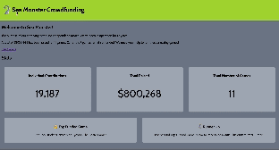

# WEB102 Prework - *Funds 4 TopGames*

Submitted by: **Rudy Orahin**

**Funds 4 TopGames** is a website for the company Sea Monster Crowdfunding that displays information about the games they have funded.

Time spent: **2** hours spent in total

## Required Features

The following **required** functionality is completed:

* [x] The introduction section explains the background of the company and how many games remain unfunded.
* [x] The Stats section includes information about the total contributions and dollars raised as well as the top two most funded games.
* [x] The Our Games section initially displays all games funded by Sea Monster Crowdfunding
* [x] The Our Games section has three buttons that allow the user to display only unfunded games, only funded games, or all games.

The following **optional** features are implemented:

* [x] List anything else that you can get done to improve the app functionality!

## Video Walkthrough

Here's a walkthrough of implemented features:

<!-- Replace this with whatever GIF tool you used! -->
GIF created with Kap 
<!-- Recommended tools:
[Kap](https://getkap.co/) for macOS
[ScreenToGif](https://www.screentogif.com/) for Windows
[peek](https://github.com/phw/peek) for Linux. -->

## Notes

While building the app, I encountered several challenges that provided valuable learning experiences. One of the primary challenges was implementing the dynamic filtering functionality in the "Our Games" section. Ensuring that the filters for funded and unfunded games worked correctly required a careful approach to JavaScript array manipulation and DOM updates.

Another challenge was in designing a responsive and visually appealing layout. Balancing aesthetics with functionality, especially ensuring the website was responsive and accessible on various devices, required meticulous CSS adjustments and testing.

Additionally, integrating a search feature posed its own set of challenges, particularly in efficiently searching and updating the UI without affecting performance. This involved understanding and implementing efficient search algorithms and handling user input dynamically.

Lastly, managing and organizing the code to keep it maintainable and readable was a continuous task. As the app grew in complexity, refactoring and organizing code to ensure scalability became increasingly important. This involved applying best practices in code structure and design patterns.

Overall, these challenges were instrumental in enhancing my skills in web development, particularly in JavaScript, CSS, and responsive design.

## License

    Copyright [2024] [Rudy Orahin]

    Licensed under the Apache License, Version 2.0 (the "License");
    you may not use this file except in compliance with the License.
    You may obtain a copy of the License at

        http://www.apache.org/licenses/LICENSE-2.0

    Unless required by applicable law or agreed to in writing, software
    distributed under the License is distributed on an "AS IS" BASIS,
    WITHOUT WARRANTIES OR CONDITIONS OF ANY KIND, either express or implied.
    See the License for the specific language governing permissions and
    limitations under the License.
